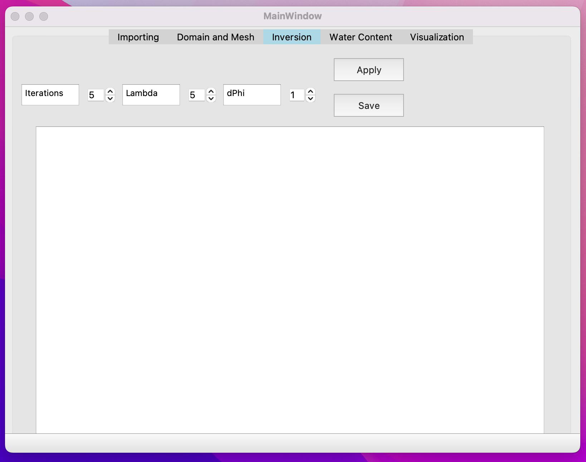
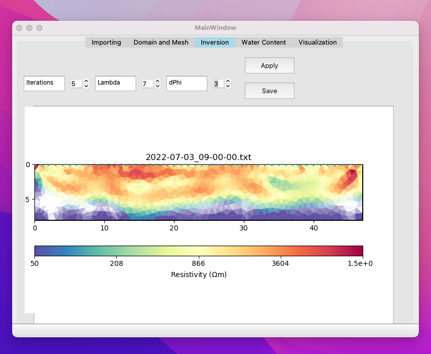
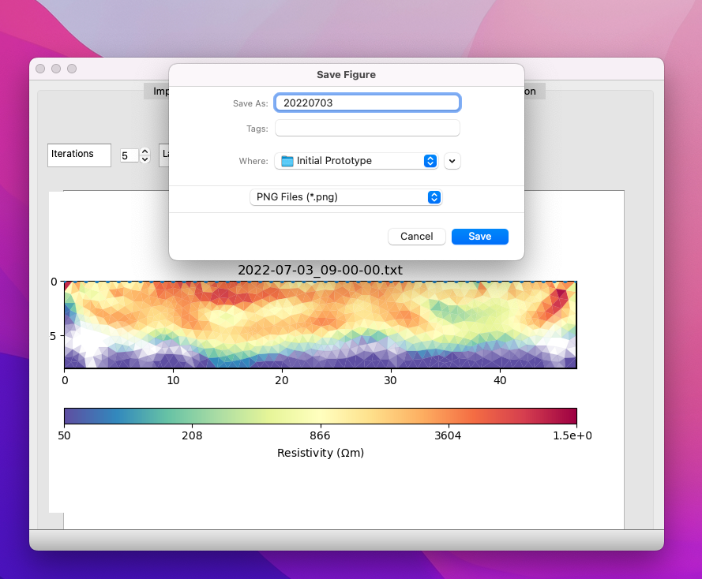

## Inverse Model Computing
The Inversion window in this PyQt5-based application allows users to perform inversion on geophysical data using the PyGIMLi library. Inversion is a crucial step, where you can estimate resistivity based on measured data. This readme provides an overview of the Inversion window and its functionalities.

### Inversion Parameters
In the Inversion window, users can configure the inversion process by specifying three essential parameters using spinboxes:

#### 1. Maximum Iterations (MaxIter)
Spinbox Name: Iterations - spinBox_8

Description: This parameter controls the maximum number of iterations for the inversion algorithm. It determines how many times the algorithm will refine the model to achieve a better fit between the observed and predicted data.

Range: Minimum value: 5, Maximum value: 30

Usage: Adjust this parameter to control the trade-off between model accuracy and computation time. Higher values can lead to more accurate results but may require more time.

#### 2. Lambda (λ)
Spinbox Name: Lambda - spinBox_11

Description: Lambda, denoted as λ, is the regularization parameter used in inversion algorithms. It helps prevent overfitting by penalizing complex models. Users can adjust this parameter to control the smoothness of the inverted model.

Range: Minimum value: 5, Maximum value: 30

Usage: Lambda is a critical parameter in inversion. Smaller values result in smoother models, while larger values may produce more detailed but noisy models. Finding the right balance is essential.

#### 3. Delta Phi (dPhi)

Spinbox Name: dPhi - spinBox_10

Description: Delta Phi, denoted as dPhi, is another parameter used in inversion to control model smoothness. It determines the allowable change in resistivity between neighboring cells in the model.

Range: Minimum value: 1, Maximum value: 10

Usage: Smaller values of dPhi result in smoother models, while larger values allow for more abrupt changes in resistivity. Adjust this parameter based on the expected geological features in your study area.

### Applying Inversion

To apply inversion with the specified parameters, follow these steps:

Input your geophysical data by clicking the "Import" button in the "Data" tab and selecting the data file.

Create the mesh in the "Domain and Mesh" window

Configure the inversion parameters (MaxIter, λ, dPhi) using the provided spinboxes in the "Inversion" tab.

Click the "Apply" button to start the inversion process. The algorithm will iteratively refine the model to match the observed data.

The inversion results: resistivity of the selected mesh will display in the middle of the window.

Remember that the choice of these parameters should be guided by the nature of your geophysical data and the geological structures you aim to resolve.

### Saving Inversion Results
You can save the inversion results as image files for documentation or further analysis. Click the "Save" button in the "Inversion" tab, and a file dialog will prompt you to choose the save location and file format (e.g., PNG).

### Additional Notes
Ensure that you have imported valid geophysical data in the "Data" tab before proceeding with inversion.

The inversion process may take some time, depending on the selected parameters and the complexity of the data. Please be patient and monitor the progress.

The PyGIMLi library is used for the inversion process, and the algorithm's behavior can be further customized by modifying the code in the startInversion function.

Please refer to the application's user manual or consult with geophysical experts for more in-depth guidance on choosing appropriate inversion parameters and interpreting the results.